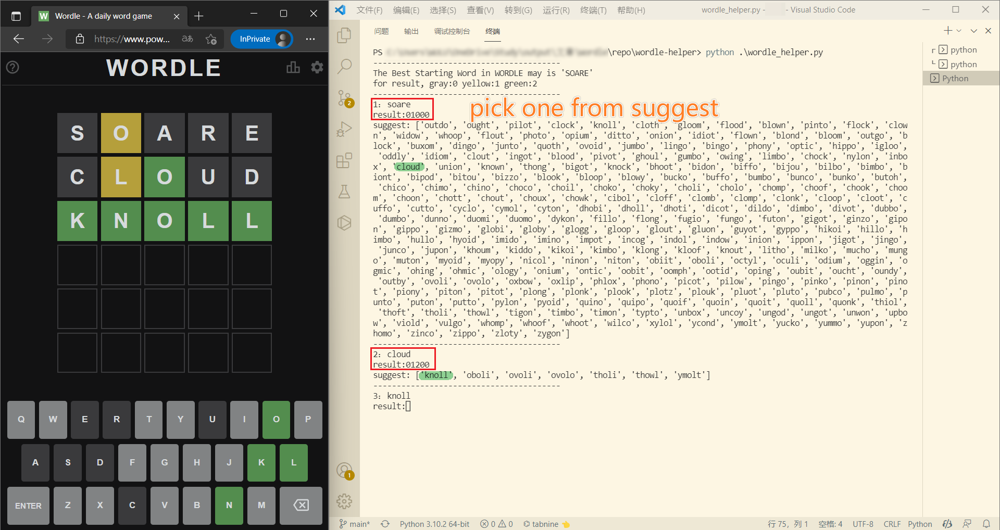

# wordle-helper
A python script to help solve [WORDLE](https://www.nytimes.com/games/wordle/) game

相关文章：[Python Wordle 解题小帮手](https://wulu.zone/posts/Wordle-Python)

## Usage
```
git clone https://github.com/eMUQI/wordle-helper.git
cd wordle-helper
python ./wordle_help.py
```

When number appears, enter the corresponding guess.
Then, when "result" appears, enter the color of the wordle prompt in numeric form. Use 0 for gray, 1 for yellow, and 2 for green.
